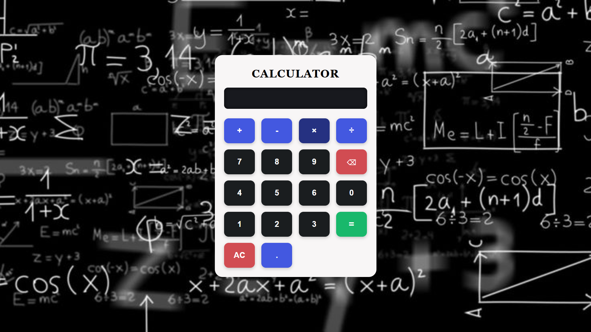

# 🧮 Calculator Web App

A modern, responsive, and intuitive **calculator web application** built from scratch using **HTML**, **CSS**, and **vanilla JavaScript**. Designed for simplicity and functionality, it enables users to perform basic arithmetic operations seamlessly with a clean user interface and smooth UX.

---

## 🚀 Features

- ➕ **Addition**, ➖ **Subtraction**, ✖️ **Multiplication**, ➗ **Division**
- 🔢 **Decimal precision** support
- 🧹 **Clear All (`AC`)** and ⌫ **Backspace** functionality
- ⚠️ **Real-time input validation** to avoid invalid expressions
- 📱 **Responsive layout** optimized for all screen sizes
- 🖱️ Fully **click-based** interaction (keyboard-free)

---

## 🛠️ Tech Stack

| Technology | Description |
|------------|-------------|
| 🧱 HTML5 | Markup structure for the calculator layout |
| 🎨 CSS3 | Responsive, styled layout with modern UI design |
| ⚙️ JavaScript (Vanilla) | Core logic for input handling and calculation |

---

## 📸 UI Preview

Here’s a visual overview of the calculator interface:

> ✨ The calculator is centered with a dark-themed math background and color-coded functional buttons for better UX.

---

## 🌐 Live Demo

🎯 Try it live:  
🔗 [Click Here to Launch the App](https://Aathi-S345.github.io/calculator)

---

## 📁 Project Structure

calculator/
├── index.html
├── style.css
├── script.js
├── README.md
└── asset/
├── icon.png
├── background.jpeg
└── screenshot.png 

---

## 🧑‍💻 Author

- 👨‍💻 GitHub: [Aathi-S345](https://github.com/Aathi-S345)
- 📧 Email: aathisenthil18@gmail.com
- 🌍 Location: Karur, Tamil Nadu, India

---

## 📄 License

This project is licensed under the **MIT License**.  
You are free to use, modify, and distribute this project with attribution.

---

## 💡 Potential Future Enhancements

- ⌨️ Add **keyboard input** functionality
- 🧮 Build a **scientific calculator** module
- 🌙 Enable **Dark/Light mode toggle**
- 📊 Add a **calculation history** log

---

## 🙌 Acknowledgements

Thanks for checking out this project!  
Feel free to ⭐️ the repo if you found it useful and share feedback or improvements.

---

